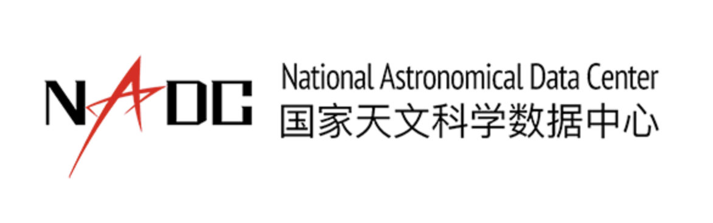

# PythonForAstro
Python basics and data analysis for astronomers.

This is a Python Crush Course for Astronomers who are new in this field. Here you will learn several frequently used packages, i.e. astropy, pandas, numpy etc.
The full courses are [here](https://hebl.china-vo.org/course/PIA2020/)

